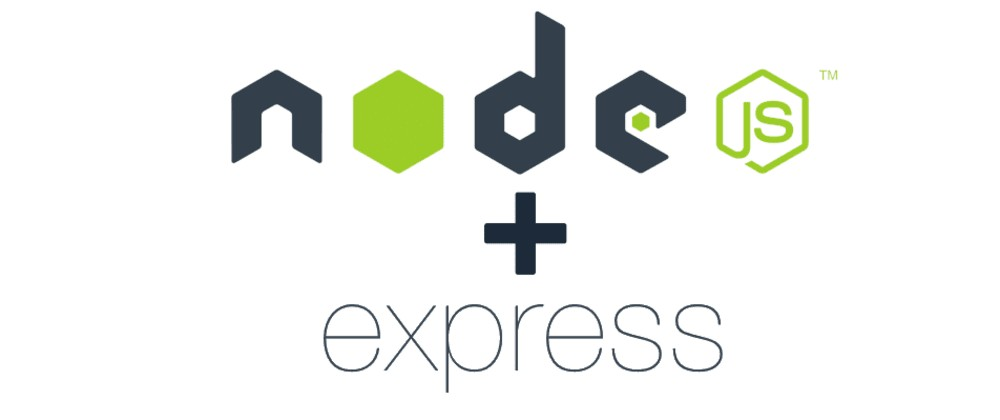

<div align="center"> 
    
</div>

<br>
<br>

## What is the project about?

This project was made to practice basic NodeJS lessons.

---

# Technologies used
- [SQL](https://www.w3schools.com/sql/)
- [MySQL Workbench](https://www.mysql.com/products/workbench/)
- [NodeJS](https://nodejs.org/en/about/)
- [Express](https://expressjs.com/pt-br/)

#

# Developed skills
 - Ler e escrever arquivos localmente usando o fs do NodeJS
 - Realizar operações assíncronas com Promises
 - Entender a construção de uma API com o uso do NodeJS e do Express
 - Entender o uso de middlewares
#

# Instruções

```bash
    # Clonar repositório

    $ git clone git@github.com:CrisSouzaMA/trybe-talker-manager.git

    # Entrar no diretório

    $ cd trybe-node-talker-manager

```

<br>
<br>
<br>
